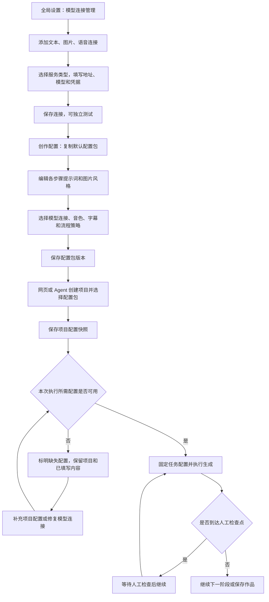

**一、全局设置 → 模型连接管理**

入口：现有“系统设置”。将原来唯一一组文本、图片、TTS 设置改为“模型连接”列表；系统设置仍然是集中管理入口，每个项目通过引用选择连接。

这里的“系统/服务类型”指接入协议或供应商适配器，例如当前已有的 OpenAI 兼容文本/图片接口、MiniMax 语音适配器等。只展示仓库实际支持的类型，填写自定义地址不会自动获得一种新协议的支持。

**1. 页面结构与连接定义**

页面提供“文本模型”“图片模型”“语音模型”三个分类。文本连接增加“支持图片理解”等能力标记，供 AI Mask 和参考图反推等功能筛选，不要求用户多维护一个重复的视觉模型库。

一条连接表示“一套可以独立选择的服务地址、模型和认证方式”。用户只需要填写一个表单，不必先创建供应商、再创建模型、再组合连接。

同一服务地址可以添加多个模型记录；同一模型也可以因为不同凭据、账号或参数添加多条连接。例如“文本·日常创作”“文本·精细规划”“图片·账号 A”“MiniMax·账号 A”“MiniMax·账号 B”。

| 列表元素 | 展示与交互 |
| --- | --- |
| 名称、类型、服务、模型、账号备注 | 名称用于下拉选择，账号备注只用于组织创作资源，不代表登录权限 |
| 生命周期状态 | 可用、已归档、已停用；与连接测试结果分开显示 |
| 测试信息 | 未测试、上次成功或失败、测试时间及对应版本；测试通过不保证未来配额或服务可用 |
| 引用数量 | 查看哪些配置包版本和项目引用该连接 |
| 添加 | 打开所属类型的空白表单 |
| 编辑 | 编辑公开配置；保存后形成新连接版本 |
| 复制 | 复制非敏感配置，填写新名称；凭据需明确选择复用现有凭据或填写新凭据 |
| 设为新建默认 | 用于新建配置包时预填和无项目试用，不影响已有包与项目 |
| 测试 | 打开该连接的测试区；不修改全局默认或项目配置 |
| 归档 | 新绑定不可选择，已有绑定继续可用 |
| 停用 | 阻止后续模型请求，已有项目显示连接已停用；已经发出的请求不能保证立即撤回 |

有历史引用的连接保留记录和版本，不直接硬删除。无引用连接可删除。已归档连接可恢复；停用连接恢复后仍使用原版本配置。

列表为空时显示“添加文本/图片/语音连接”。添加操作不要求其他类别已有连接。

**2. 添加或编辑表单**

| 字段 | 文本 | 图片 | 语音 |
| --- | --- | --- | --- |
| 名称、账号备注 | 支持 | 支持 | 支持 |
| 服务/协议类型 | 仓库支持的文本协议 | 仓库支持的生图协议 | 已实现的 TTS Provider |
| Base URL / Endpoint | 支持 | 支持 | 按 Provider 展示 |
| API Key 等凭据 | 按协议展示 | 按协议展示 | 按 Provider 展示 Key、SecretKey 等 |
| 模型标识 | 支持 | 支持 | 支持 |
| 默认请求参数 | 温度、最大 Token 等 | 请求尺寸等 | 协议相关参数、区域等 |
| 能力信息 | 文本、图片输入等 | 参考图、编辑等实际能力 | 音色、克隆等实际能力 |
| 服务专属设置 | 按已实现协议展示 | 按已实现协议展示 | 如本地工作流等版本化资源 |

模型标识允许手动填写；供应商支持列举模型时可以额外提供选择，不把模型发现作为添加连接的必要条件。

Voice ID、语速、音量、音调主要归属于创作配置包。语音连接可提供临时试听音色或新建时推荐值，但不得覆盖项目已经保存的声音参数。

连接中的默认请求参数是“新绑定时的默认值”。配置包选择连接后将参数补齐并随版本保存；以后修改连接默认值不会隐式改变已有包。

切换服务类型时重新展示适配器字段，清除不兼容字段前展示具体影响；不把旧服务专属参数原样传入新服务。

保存时校验名称、类型、地址格式、模型及参数结构。仅保存不主动发起生图或配音请求。联网测试单独操作，失败保留表单内容并显示具体失败位置。

已有密钥只显示“已配置”，不回传原文。更新接口区分“保持不变”“替换”“清除”，不能把掩码字符串当作新密钥保存。新连接可以作为“待配置”保存，但缺少所需凭据时不能执行对应生成。

**3. 测试区**

文本测试使用最小请求；图片测试允许输入简短内容生成一张测试图；语音测试允许输入文本和 Voice ID 生成试听音频。按钮应直接写明“生成测试图”“合成试听”，说明将调用所选服务。

未保存表单可以测试，但结果标记为“当前草稿测试”，只有表单内容与保存版本一致时才能作为该版本的测试记录。

支持图片理解、参考图编辑等能力分别记录验证结果；普通文本请求成功不能推导为支持多模态。能力未知允许保存，使用具体功能时做对应校验，不默默换用另一条连接。

测试图和试听音频作为测试产物保存，不写入正式项目，也不改变默认连接。

**4. 凭据与连接变更**

界面仍在连接表单内维护凭据，底层通过独立凭据存储持有实际密钥。配置包只绑定连接，项目有效配置可保存凭据引用，不包含密钥原文。

同一逻辑账号、同一服务的密钥轮换可以更新原凭据引用，使旧项目恢复调用；更换供应商账号、接口地址或服务类型应创建新的连接版本，必要时绑定新的凭据引用。私有音色、克隆音色可能绑定供应商账号，不能假设换 Key 后仍可用。

修改地址、模型、协议或默认参数形成新版本；旧项目仍使用原版本地址和模型。停用是运营控制，对历史版本也生效；密钥轮换是认证更新，不宣称完整还原历史认证状态。

**二、创作配置 → 配置包列表**

入口：新增“创作配置”；创建项目时的“管理配置”也进入此页，并保留尚未提交的新建内容。

列表显示名称、描述、账号标签、当前版本、默认标记、连接摘要、配置完整性。操作包括新建、复制、编辑、历史版本、设为默认、导入、导出、归档。

系统提供包含全部可编辑项的“内置默认配置”，可查看、复制和恢复。安装升级时另建“当前工作配置”，导入现有自定义设置并设为默认，避免直接用内置内容覆盖用户修改。

点击复制后立即创建独立配置包草稿，提示词、风格参数和资源引用完整复制；模型连接继续引用原版本，可以自行更换。修改副本不影响来源包。

保存有效编辑会形成新版本；未保存编辑不影响任何项目。历史版本不可改写，“恢复某版本”是以历史内容生成一个新版本。

不完整的配置允许保存为草稿并显示缺项。新项目可以保存为空项目；是否能执行由实际需要的阶段决定，不能因为用户暂时没有语音连接而禁止创建图片型 PPTX 项目。

被项目引用的包只能归档；归档后已有项目继续可用。导入作为新包创建，或由用户明确选择追加到某包，不通过同名自动覆盖。

**三、配置包详情 → 六个编辑区域**

入口：配置包列表的新增、复制、编辑或历史版本。历史版本只读，可复制或恢复。

**1. 基本信息**

名称、说明、账号标签；摘要展示当前版本与配置完整性。名称用于展示，ID 用于引用，重命名不破坏绑定关系。

**2. 提示词与风格**

| 配置项 | 负责内容 | 编辑规则 |
| --- | --- | --- |
| 文章生成 | 语气、表达方式、内容组织 | 导入文章不会因为修改此项被自动改写 |
| 文章转分镜 | 分页、页内信息、讲述组织 | 与已有分镜规则/Profile 配套保存 |
| 分镜可视化 | 视觉表达方式、信息关系和画面规划 | 保留独立提示词与输出预览 |
| 图片生成 | 生成图片的提示词规则 | 与风格描述和参考图共同生效 |
| AI Mask | 多模态语义匹配等现有可编辑项 | 不允许通过提示词绕过确定性 Mask 完整性校验 |
| 旁白标注 | 旁白处理、语音表达等现有可编辑项 | 与所选 TTS 能力保持兼容 |
| 高级风格工具 | 参考图生成、反推等已有可编辑提示词 | 接入时纳入统一目录，避免继续使用独立全局回退 |

各区域展示用途、可编辑内容、完整 Prompt 预览、恢复默认、从已有模板填入。输出示例、分镜规则等当前影响生产结果的内容一并版本化，不只复制 system 字符串。

稳定的协议、JSON 输出要求和确定性派生字段由现有代码负责。完整预览必须与实际运行组合一致。实施新 Prompt 或迁移 Prompt 时先使用仓库的 optimize-prompts 技能；仅迁移识别出的旧内置默认，不覆盖真实自定义。

第一版使用“一个包里编辑全部内容”的方式。已有分镜和图片模板作为填入来源，选用时复制内容与资源版本，不建立会自动追随最新模板的隐式继承链。

**3. 模型选择**

| 用途 | 可选连接 | 默认行为 |
| --- | --- | --- |
| 文章、分镜、旁白 | 文本连接 | 共享包内默认文本连接 |
| AI Mask、参考图理解 | 支持图片输入的文本连接 | 默认文本连接能力满足时可复用，否则明确选择 |
| 图片生成、风格参考图生成 | 图片连接 | 使用包内默认图片连接 |
| 语音合成 | 语音连接 | 使用包内所选语音连接 |

高级区域允许文章、分镜规划、分镜可视化、旁白等步骤分别选择连接。未设置覆盖的步骤继承包内默认，保存时展开为有效配置；不在运行时继承可变全局默认。

模型标识归属于连接记录。要使用同一地址上的另一模型，可以复制连接并修改模型后在包中选择，避免连接详情写一个模型、包里又暗中改成另一个。

参数优先级为：连接版本默认参数 → 配置包明确覆盖 → 项目明确覆盖。绑定或创建时补齐并冻结结果，运行阶段只使用解析结果。

选择连接时展示连接版本和模型。连接有新版本时显示可更新提示，点击后查看差异并保存新包版本，不自动更新所有包。

**4. 图片、声音与字幕**

图片：风格描述、风格参考图及现有参数、最终视频背景、画面规格、Mask 和 Reveal 已有选项。继续遵守当前生产图像和 Mask 规则；供应商请求尺寸与最终产物规格分别校验。

声音：Voice ID、clone Voice ID（当前服务支持时）、语速、音量、音调和必要的服务专属参数；提供使用当前包所选连接的试听。不同 Provider 按能力显示参数，不透传不支持的字段。

字幕：新增 `subtitles.enabled`，默认 true；保留字体、字号、颜色、分页、高亮、位置等现有样式。关闭后隐藏或禁用样式编辑区，但保留值。

注意：现有 Visual Contract 的 `presentation_policy.subtitle_policy` 控制幻灯片页面的副标题字段，不是随旁白显示的视频字幕。不得把该字段作为视频字幕开关，也不需要为关视频字幕去删除页面副标题。

视频字幕关闭时，Remotion 不渲染字幕节点；内部 SRT、音频时间轴继续生成和校验。图片中的标题、标签和正文不受影响。重新开启通常只需重渲染，不重新合成声音。第一版保留现有字幕安全区，无字幕画面的重新布局另行处理。

**5. 自动化策略**

使用两类独立字段表达：功能是否启用，以及哪些阶段完成后需要检查。

| 功能开关 | 含义 |
| --- | --- |
| Mask | 使用现有跳过规则；关闭后仍构建静态场景 |
| 字幕 | 仅控制视频字幕显示，不产生额外生产阶段 |
| 数字人 | 复制现有项目数字人配置；启用不等于当前一键流程已支持自动生成 |

检查点统一列为：分镜完成、图片完成、Mask 完成、旁白完成、配音完成、视频完成。选择的是“完成后暂停”，界面文字与执行语义一致。

无检查点时全自动继续；配音检查点开启时，技术合成成功后等待用户试听放行，不被内部技术确认自动绕过。检查点关闭则保留现有成功后自动继续语义。

数字人当前属于独立能力，主 one-click 阶段中没有完整数字人生成功能。“配音后进入数字人处理”与“配音试听”分别显示，但同一阶段后的要求可以合并为一次等待状态，完成所有要求后继续。不得为此破坏可选数字人不计必需进度的现有规则。

现有 `review_policy`、`manual_pause_steps` 和任务 `stop_at` 通过一个适配器归一化，旧参数保持兼容，新页面只编辑统一检查点。任务级 stop_at 属于单次执行的限制，不反向修改配置包；冲突时以更早的暂停要求为准。

**6. 保存与失败状态**

保存失败保留当前编辑；版本冲突返回最新版本信息，禁止静默覆盖另一处修改。连接已归档但包原来已绑定时可继续保留该引用；新绑定不能选择归档连接。连接停用时显示具体用途，允许保存草稿，执行对应阶段前阻止调用。

导入配置包缺少连接或参考图时标记具体缺项，提供映射连接、补传资源入口。模型名称相同不代表同一服务或账号，不能自动绑定任意同名连接。

**四、项目列表 → 创建项目**

入口：现有新建项目按钮；Agent/API/CLI/MCP 创建也使用相同后端服务。

表单保留名称、说明和现有创建能力，增加创作配置包选择。文章来源沿用现有页面路径；后端继续允许先创建空项目再导入文章。

选中包后展示固定版本、提示词风格摘要、文本/图片/语音连接名称及模型、音色、字幕、Mask、数字人和检查点。

“调整本项目”展开字幕、音色、检查点等常用项，以及模型连接等高级覆盖。覆盖标记为“仅本项目”；切换配置包时明确提示这些覆盖会如何处理，默认先展示差异，由用户选择保留兼容覆盖或全部采用新包，不能悄悄混合。

提交时同时传包 ID、版本和项目覆盖，不再先创建项目再由浏览器逐个应用模板。重复点击由提交状态与幂等控制避免创建多份项目。

选择后到提交前，包新增版本时仍创建所见版本。未指定版本的自动化请求由服务端在首次接受时解析最新版本并固定；相同幂等请求重试返回同一项目，不重新解析最新包。

创建空项目可以成功；点击生成或启动自动化时，仅校验本次实际所需能力。例如已导入文章不要求调用文章生成；仅制作图片型 PPTX 不要求配置 TTS；Mask 关闭时不要求其多模态连接。

结构不合法、指定版本不存在或资源引用损坏时拒绝创建并保留表单。凭据未配置可创建待配置项目，但不得在正式生产中静默改用其他全局连接。

**五、项目工作区 → 本项目配置**

入口：工作区新增“本项目配置”按钮；各步骤的提示词、图片风格、声音和字幕入口链接到对应区域。页面展示来源包、版本、当前项目配置修订号及本项目修改项。

现有步骤编辑器继续可用，保存到统一项目配置；界面注明修改范围为本项目。提供“另存为创作配置”和“应用其他配置包”，均不修改来源包。

| 操作 | 结果 |
| --- | --- |
| 修改配置包 | 产生新包版本，现有项目不动 |
| 修改项目配置 | 产生项目配置新修订，后续任务使用该修订 |
| 修改连接地址/模型 | 产生新连接版本，旧包和项目不自动更新 |
| 同一账号密钥轮换 | 原凭据引用继续使用新密钥，业务配置不变 |
| 重试失败任务 | 使用该任务固定配置，除非明确放弃旧任务并重新提交 |
| 应用新包/连接版本 | 展示差异和需重做的步骤，确认后生成项目新修订 |

有生成任务运行时允许查看、复制和编辑未应用草稿；第一版禁止直接应用会改变当前任务的项目配置，提示任务结束或停止后应用。并发保存使用修订号校验。

已有产物记录实际配置哈希；配置变更后展示“产物来自旧配置”和重新生成入口。失效处理复用 `invalidation_service.py`，按依赖清理派生状态，不删除用户已有作品历史。

| 变更 | 处理范围 |
| --- | --- |
| 视频字幕开关/样式 | Remotion props 和视频新鲜度，保留音频及 SRT |
| Voice ID/语速/TTS 模型 | 音频确认、相关时间轴、视频；必要时重新规范化 TTS 标记 |
| 图片生成配置 | 旧图片保留并标记来源；实际替换图片时执行现有 Mask/下游失效 |
| 分镜或文章生成配置 | 不自动重写已有内容；下一次明确生成时使用新配置 |
| 实际编辑文章/分镜 | 按现有规则使下游产物失效 |
| 检查点 | 影响之后提交的执行任务，不重做媒体 |

**六、现有三个生成接口如何接入**

保留现有 Provider 的请求、返回解析、重试和产物构建能力，新增连接解析层，替换调用点对全局配置的读取。

当前链路：业务步骤 → `get_setting("llm_*" / "image_*" / "tts_*")` → Provider。

目标链路：业务步骤 → 任务固定的项目有效配置 → 指定连接版本与凭据解析 → 现有 Provider → 原有产物格式。

| 范围 | 现有主要模块 | 具体处理 |
| --- | --- | --- |
| 文本客户端 | `ai_provider_service.py` | 保留显式 api_key/base_url 客户端工厂；连接层提供参数，不把项目查库放入底层客户端 |
| 文章生成 | `article_service.py` | 从项目配置取文章 Prompt 和文本连接，覆盖目前全局读取路径 |
| 分镜请求 | `storyboard_service.py`、`storyboard_llm.py` | 编排层传入对应连接和参数，保持纯规划层、模板层、LLM 层边界 |
| 通用 JSON 生成 | `json_llm_service.py` | 接收显式请求配置；修复请求沿用本次原连接，避免修复时回读全局 |
| AI Mask | `ai_mask_service.py`、`ai_mask_engine.py` 等 | 注入项目有效多模态配置和 Prompt，保持窄依赖及确定性算法不变 |
| 旁白 | `narration_service.py` | 项目 Prompt 与连接共同解析；与 TTS 配置协调标记处理 |
| 图片生成 | `image_workflow_service.py`、`ai_provider_service.py` | 用项目图片连接创建请求；保留图像解码、白底归一化和供应商兼容处理 |
| 风格参考图/反推 | `project_style_*`、`image_style_reverse_service.py` 等 | 项目内用项目配置；配置包编辑中的试用明确传包版本或草稿连接，不能偷偷使用全局 |
| TTS | `tts_service.py`、`tts_provider_service.py` | 从项目取 Provider、模型、声音参数；从连接取认证，继续按子进程独立环境传密钥 |
| 字幕 | `visual_settings_service.py`、`scripts/build_remotion_props.py`、`scripts/remotion/src/Video.tsx` | 新开关贯穿保存、归一化、props、React 渲染及视频过期判断 |
| 连接测试 | `settings_service.py`、`settings_routes.py` | 复用测试实现，增加保存连接 ID/版本和草稿测试入口，废除回读不相关全局参数 |

严禁“先把包里的配置写进全局 Setting → 调用旧接口 → 再恢复全局”。即使增加锁也难以覆盖异步任务、重试和多个进程，会产生串配置。

不要修改全局 `os.environ` 来临时切换 TTS 密钥。每次子进程传自己的环境映射；客户端若缓存，缓存键必须区分连接版本和凭据修订，防止旧认证残留。

请求兼容性回退仍可保留，但限于同一已选连接内的协议适配，不能未经配置切换到另一个模型连接或账号。

配置包管理中的无项目试用必须携带明确连接或有效草稿配置。界面可以预填新建默认连接，但请求发出时应已解析为具体版本。

供应商模型可能在同一名称下变化；配置快照保证保存我们提交的配置，不保证外部模型永久不变或生成结果逐像素一致。

**七、数据结构与存储方案（建议新增）**

| 对象 | 核心字段 | 约束 |
| --- | --- | --- |
| `model_connections` | id、name、kind、account_label、status、current_revision | 名称可改，ID 稳定；kind 为 text/image/tts |
| `model_connection_revisions` | connection_id、revision、provider、endpoint、model、capabilities、default_params、credential_ref、resource_refs | 非敏感配置不可变；连接测试结果独立记录 |
| 凭据存储 | credential_ref、认证材料、逻辑服务/账号信息 | 普通读取接口不返回原文；不进入包和项目导出 |
| `creation_packages` | id、name、description、tags、status、current_version | 归档保留历史引用 |
| `creation_package_versions` | package_id、version、schema_version、payload、content_hash | 不可变；Prompt、风格、引用连接版本及完整参数都保存 |
| `project_config_revisions` | project_id、revision、source_package_id/version、effective_config、config_hash | 项目运行配置唯一权威来源 |
| 任务配置绑定 | job/operation_id、project_config_revision、config_hash、连接修订摘要 | 每次任务固定；持久化恢复不重新读最新全局 |
| 不可变资源 | 内容哈希、类型、路径、引用关系 | 参考图/工作流等按内容保存；无引用后再回收 |

包的主要结构建议为 `prompts`、`storyboard_rules`、`model_bindings`、`image_style`、`tts`、`subtitles`、`workflow`、`digital_human`。细节仍应复用现有字段定义和规范化函数，避免再复制一套规则。

数据库作为配置事实来源；项目目录可导出 `planning/project_config.json` 供脚本消费，但它是带修订和哈希的生成物，不允许数据库和文件双向独立编辑。现有 `step2_prompts.json`、`step3_image_prompts.json`、`visual_settings.json` 等在过渡期由统一配置生成，保留脚本兼容性。

资源先写临时区、校验后存入不可变内容路径；数据库事务再记录配置、资源引用和项目。事务失败的未引用资源可清理。项目配置运行文件写入失败时标记初始化待完成并重试，启动生产前验证一致性；不把 SQLite 事务描述为能回滚文件系统。

新增表和列使用下一个可用连续编号 migration，实施时检查最新编号，不修改已应用迁移。`repository_paths.py` 注册新增资源路径；`server.py` 只做依赖组装和路由注册。

建议新增模块按下表划分，实施时再核对命名冲突，不把业务放回现有大模块：

| 建议模块 | 责任 |
| --- | --- |
| `model_connection_models.py`、`model_connection_service.py`、`model_connection_routes.py` | 连接字段、版本和生命周期、HTTP；Provider 调用继续复用原服务 |
| `credential_store.py` | 凭据写入、解析、轮换和脱敏边界 |
| `creation_config_models.py`、`creation_config_service.py`、`creation_config_routes.py` | 配置包定义、版本、导入导出和 HTTP |
| `project_config_service.py` | 项目有效配置、修订、任务绑定及过渡文件生成 |
| `static/model_connections.js` | 连接列表、表单、测试和状态展示 |
| `static/creation_configs.js` | 配置包列表、编辑、版本与导入映射 |

创建选择器仍由 `static/projects.js` 负责；各步骤编辑入口保持原模块所有权，通过显式桥接调用配置界面。新前端脚本在 `static/index.html` 声明顺序并补充 `checks/test_frontend_quality.js` 所有权约束，不向 `workflow_state.js` 集中业务函数。

**八、HTTP、Agent、CLI 和 MCP 契约（以下均为提案）**

| 接口族 | 操作 |
| --- | --- |
| `/api/model-connections` | 列表、新增；支持按类型和能力筛选 |
| `/api/model-connections/{id}` | 详情、编辑、生命周期操作 |
| `/api/model-connections/{id}/revisions` | 版本列表、指定版本 |
| `/api/model-connections/{id}/test` | 测试指定保存版本 |
| `/api/model-connections/test-draft` | 测试未保存参数；密钥仅请求使用，不回显 |
| `/api/creation-packages` | 列表、新增 |
| `/api/creation-packages/{id}/versions` | 读取和保存新版本，携带预期当前版本避免覆盖 |
| `/api/creation-packages/{id}/copy` | 复制独立配置包 |
| 配置包 import/export | 新包导入、连接映射、资源校验，默认无密钥 |
| `/api/projects` | 扩展选择包、版本和项目覆盖，保留原有创建语义 |
| `/api/projects/{id}/configuration` | 查看与更新项目配置；基于修订号并返回受影响步骤 |
| 项目配置应用/另存接口 | 应用指定包版本、另存为新包 |

项目创建请求示例（在现有字段基础上新增，ID 为示意）：

```json
{
  "name": "科普账号第十期",
  "config_package_id": "pkg_science",
  "config_package_version": 3,
  "overrides": {
    "subtitles": {"enabled": false},
    "tts": {"voice_id": "voice_for_account_a", "speed": 1.05}
  }
}
```

配置包中模型选择片段（省略其他字段）：

```json
{
  "model_bindings": {
    "text_default": {"connection_id": "conn_text_a", "revision": 2},
    "vision_default": {"connection_id": "conn_vision_a", "revision": 1},
    "image_default": {"connection_id": "conn_image_a", "revision": 1},
    "tts": {"connection_id": "conn_tts_a", "revision": 4}
  },
  "tts": {"voice_id": "voice_for_account_a", "speed": 1.0},
  "subtitles": {"enabled": true},
  "workflow": {"review_after": ["audio_review"]}
}
```

覆盖规则：缺省字段继承；false、0、空列表作为显式值按字段规则处理；null 仅用于 schema 明确允许的“清除/无值”；对象逐字段合并、列表整体替换、未知字段拒绝。接口返回最终有效配置摘要、来源版本、项目修订，敏感参数不返回。

首次解析后不要只保存一个会漂移的 `latest` 引用。模型与 Prompt 版本须参与产物来源记录；继续使用现有 render pipeline version，不能以配置哈希替代算法版本检查。

Agent 创建、配置查询与管理能力必须统一注册到 `agent_contract/capabilities.py`；请求响应在 `agent_contract/models.py` 定义，`agent_api/routes.py` 负责映射。新增字段同步 parity mapping；按兼容性提升 capability 和 AGENT_API_VERSION，重新生成文档，并同步传输测试。不能只扩网页请求。

旧 Agent 创建请求缺包参数时使用迁移后的默认包并立即固定；旧参数如 mask_enabled 作为明确覆盖处理。API schema 必须区分字段缺省和显式 false，不能让旧默认值无意覆盖所选包。

**九、旧全局设置及旧项目迁移**

1. 使用现有 `llm_*`、`image_*`、`tts_*` 分别生成“原默认文本”“原默认图片”“原默认语音”连接，并保存第一个版本；缺字段保留待配置状态。
2. 迁移凭据到独立引用。历史配置和导出文件中的掩码不能当作实际密钥；保留当前脱敏、日志处理和环境传递规则。
3. 将当前文章、Mask、旁白等全局 Prompt，Step 2 模板默认，图片风格与声音参数组合为“当前工作配置”。项目级 Prompt 不拿来覆盖其他项目。
4. 对旧项目优先读取项目已有 Prompt、图片风格、字幕、数字人等文件，再用迁移时的全局配置补齐缺项，生成项目配置第一个修订。
5. 记录哪些字段来自补齐。历史上未记录的全局音色和模型不能被准确恢复；保留已有产物并记录来源未知，不伪造历史配置。
6. 首次升级应在受控启动窗口完成。已有活动任务先按项目现有恢复策略结束或标记中断，不能让同一任务执行中从全局读取切换为项目读取。
7. 新生产路径禁止永久回退到可变全局键。遗留项目若尚未迁移，先做一次兼容快照并持久化，再开始生成。
8. 迁移完成后，旧 `/api/settings` 可以继续读出兼容默认投影；旧写入模型字段只形成默认连接新版本及新建默认包新版本，不影响已有项目，并返回迁移提示。旧入口无法表达多连接管理，后续按版本计划废弃。
9. 原全局导入导出保留“环境备份/迁移”的定位；新增包导入不得复用“覆盖全局设置”的写入路径。旧备份导入先预览转换出的连接和包，再新增/明确合并，不同名静默覆盖。
10. 新包导出包含 Prompt、风格、资源、非敏感连接描述及待映射标识；导入时映射本机连接或新建待配置连接，不携带密钥。全环境凭据备份继续走现有明确授权的专门路径。

迁移需幂等、可检测部分完成状态，并在完成新配置校验前保留旧数据。配置迁移不会重做图片、声音或视频。

**十、实施拆分与验收**

| 顺序 | 实现单元 | 完成标准 |
| --- | --- | --- |
| 1 | 连接模型、凭据引用、不可变版本、解析器、迁移 | 三类都能添加多条连接；指定版本解析稳定；旧默认迁移可重跑 |
| 2 | 连接管理页面与测试接口 | 新增、复制、编辑、测试、归档、停用可用；操作不写其他连接 |
| 3 | 配置包模型、资源与编辑页面 | 全部主要 Prompt、风格、模型连接、声音、字幕和检查点可保存复制 |
| 4 | 项目快照和创建接口 | 网页与 Agent 选择同一包得到同一有效配置；空项目仍有效 |
| 5 | 所有生产与试用调用接入 | 文本、图片、Mask、旁白、TTS、JSON 修复、风格工具和重试无隐式全局回读 |
| 6 | 字幕与工作流集成 | 关字幕只影响动态字幕；试听检查点生效；跳过阶段进度正确 |
| 7 | 项目配置编辑、产物新鲜度、导入导出 | 配置改变影响范围正确；无双写漂移；导入不覆盖全局 |
| 8 | 契约同步与完整验证 | Agent/MCP/CLI 覆盖、迁移与并发测试、浏览器流程及实际视频验证通过 |

每个单元可独立实现和验证，但第一版交付应贯穿到第 8 项，不能仅交付页面和配置表而仍用全局参数生产。更复杂的账号权限、多级模板继承、自动成本路由、跨供应商故障切换可以后续处理。

**必须覆盖的验收案例**

| 场景 | 预期 |
| --- | --- |
| 两项目同时使用两套文本/图片/语音连接 | 请求端点、模型、凭据和 Voice ID 各自正确，没有串用 |
| 同一连接下两个包使用不同 Voice ID | 共用服务认证，声音参数分别生效 |
| 包第 3 版项目运行时保存第 4 版 | 原项目及其重试使用第 3 版 |
| 连接更新模型或地址 | 旧包仍用原连接版本，显式更新才采用新版本 |
| 同一逻辑账号轮换 Key | 后续请求使用新认证，不改变项目音色和 Prompt |
| 连接归档或停用 | 归档不破坏旧项目；停用阻止后续请求且错误明确 |
| 创建请求 overrides.subtitles.enabled=false | false 被保留，渲染无字幕节点 |
| 页面副标题策略与视频字幕开关组合 | 两者互不误用，图片内容不被视频开关删除 |
| 关闭字幕后重开 | 声音不重做，按新设置重渲染，视频新鲜度正确 |
| 配音检查点开启 | TTS 成功后等待试听，不自动直接渲染 |
| 手动导入文章或仅做 PPTX | 不因无关模型连接缺失被阻止 |
| 项目创建失败或重试 | 无半配置项目、无重复创建；可恢复初始化状态 |
| 包或连接版本并发编辑 | 发生版本冲突提示，不静默覆盖 |
| 重启、任务恢复与 JSON 修复 | 使用持久化的任务配置，不读取最新全局 |
| 旧项目迁移 | 项目文件优先，自定义内容保留，不伪造历史模型信息 |
| 导出与普通详情 | 无 Key/SecretKey，掩码不回写，资源引用完整 |
| 导入其他账号配置包 | 创建独立包并映射连接，不改变其他项目 |

测试以请求捕获、模拟 Provider 和隔离测试库为主，证明真实传参和状态行为；上线前再用明确选择的测试连接完成小规模端到端生成。遵循 AGENTS.md 的发布验证，包括 Agent 契约生成校验、前后端检查、迁移与失效测试，以及浏览器和实际 MP4 验证。

实施前重新检查工作区现有修改。当前已存在旁白、TTS Provider、一键生产、前端及测试的未提交修改；这些文件的改造必须在当时基线上整合，不能用本方案覆盖或撤销他人改动。

**十一、开发定位依据**

本方案基于当前仓库的代码结构。以下“当前已完成”记录第一阶段的实际落地范围；其余生产调用接入和管理界面仍按上面的实施顺序推进。

- `project_service.py`：ProjectCreate 及创建服务；现有可选项尚未承载完整配置包。
- `project_profile_store.py`：轻量项目 Profile，不能当成完整 Prompt/TTS 快照。
- `settings_routes.py`、`settings_service.py`：现有全局设置及三类一次性连接测试。
- `config_portability_service.py`：全局设置、分镜模板、Step 2 Prompt 模板与图片风格的备份导入导出。
- `ai_provider_service.py`：文本客户端工厂、生图返回解析与归一化，可继续复用。
- `article_service.py`、`storyboard_service.py`、`narration_service.py`、`image_workflow_service.py`：当前全局模型配置的业务读取点。
- `tts_service.py`、`tts_provider_service.py`：语音配置读取、Provider 适配和环境密钥传递。
- `visual_settings_service.py`、`scripts/build_remotion_props.py`、`scripts/remotion/src/Video.tsx`：动态字幕设置到视频渲染链路。
- `visual_contract_service.py`、`schemas/visual_contract.schema.json`：页面副标题策略，须与视频字幕开关分开。
- `one_click_orchestrator.py`：阶段、暂停与恢复；新增统一配置不得破坏当前顺序和可选阶段规则。
- `agent_contract`、`agent_api`、`checks/agent`：对外能力、模型、版本及兼容性校验。

**十二、已落地内容与当前边界**

- 新增 `model_connection_models.py`、`model_connection_service.py`、`model_connection_routes.py`：支持 text/image/tts 多连接、复制、不可变 revision、停用/归档和历史解析；响应不暴露凭据引用。
- 新增 `credential_store.py`、`credential_routes.py`：支持凭据引用创建、轮换、停用和内部运行时解析；当前本地 JSON 适配器可由生产密钥管理后端替换。
- 新增 `creation_config_models.py`、`creation_config_service.py`、`creation_config_routes.py`：支持配置包复制、版本、归档、显式 false 覆盖、连接引用、敏感字段拒绝和内容哈希。
- `ProjectCreate` 已接收配置包 ID、版本和项目覆盖项；项目创建时保存有效配置到 `planning/project_config.json`，数据库记录来源包、版本与哈希。
- `server.py` 已注册三组路由并注入 canonical JSON 路径；新增 `0011_project_creation_config.sql`。
- `article_service.py`、`storyboard_service.py`、`narration_service.py`、`image_workflow_service.py`、`tts_service.py` 已优先读取项目快照中的 Prompt、模型连接、Voice ID 和音频参数；旧项目或未绑定用途继续兼容全局设置，绑定失效时不会串用其他账号。
- 新建项目弹窗和 Agent `project.create` 已支持选择配置包及版本；Agent 契约已升级到 `1.3.0`，并重新生成能力矩阵。
- 系统设置已增加创作配置管理面板：可新建、复制、归档配置包，添加 text/image/tts 连接，并通过凭据引用接入独立凭据存储。配置包列表仍以 JSON 编辑为主，后续可再拆分为提示词、模型、声音、字幕和自动化策略的分区编辑器。
- `subtitle.enabled` 已贯通项目字幕设置、Remotion props 和视频渲染；关闭字幕时继续生成音频、SRT 与时间轴，只跳过字幕节点。
- 当前本地凭据适配器将密钥写入 `data/credentials.json`，适合开发验证；多用户或生产部署前应替换为操作系统 Keyring 或外部 Secret Manager。连接测试区、项目工作区的配置修订/差异应用、自动化检查点统一编辑器和完整的 Prompt 分区 UI 仍属于后续阶段。
- 当前阶段通过 Agent 契约、项目配置、媒体运行链路、前端质量、迁移和字幕/渲染相关回归测试；发布前仍需按 `AGENTS.md` 在本地浏览器完成真实连接的小规模端到端验证。
